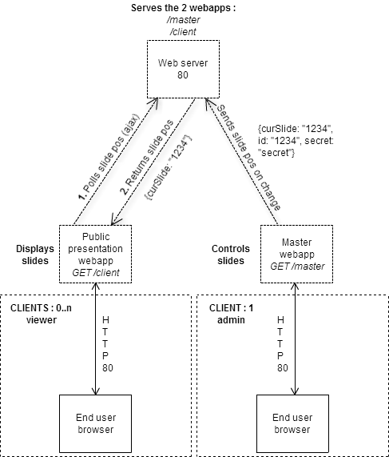

MondayTechPoint
===============

Présentation technique ou autre du Lundi

## Structure
#####/node-http-proxy-server
Http server, used to proxy http and websockets
Based on node-http-proxy : https://github.com/nodejitsu/node-http-proxy
#####/reveal
Presentations directory, this is where you can work
Based on reveal.js : https://github.com/hakimel/reveal.js/

## Installation

#####Clone project : 
```sh
$ git clone https://github.com/mleneveut/MondayTechPoint.git
```

#####In the repository, create your own branch, and switch to it :
```sh
$ git checkout -b "[presentation_name]"
```
#####Run : 
```sh
$ npm install
```
#####Create your slides / themes

#####Configure multiplex-http plugin (reveal/master/js/reveal-config.js + reveal/master/js/reveal-config-client.js)

#####Commit and push the modifications on the new branch :

```sh
$ git commit -am "Created my presentation..."
```
```sh
$ git push origin "[presentation_name]"
```

##Test your project
```sh
$ node plugin/multiplex-http
```

Go to :
-http://localhost/master/ to control the presentation
-http://localhost/client/ to see the presentation


## Multiplex-http plugin



www.ippon.fr